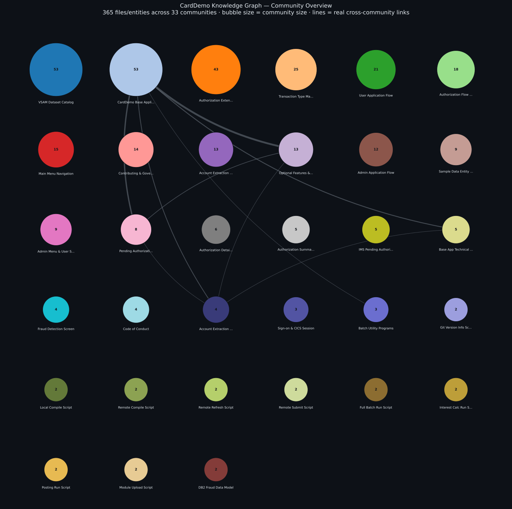

# CardDemo — a Graphify Knowledge Graph Case Study


This repository is a **case study for [graphify](https://app.graphify.com)**, not primarily a CardDemo reference. It takes AWS's [CardDemo](./docs/ORIGINAL_CARDDEMO_README.md) mainframe modernization sample application — a real, messy, mixed-technology codebase (COBOL, CICS, IMS, DB2, MQ, JCL, VSAM, shell scripts, docs, diagrams, and sample data) — and runs it through graphify to see what a knowledge-graph pass over a legacy-modernization repo actually surfaces, at what cost, and with what limitations.

The original CardDemo documentation still lives here (see [About the Underlying Application](#about-the-underlying-application) below) — this README just leads with the graphify analysis instead.

## Results at a Glance

| Metric | Value |
|:---|---:|
| Files in corpus | 36 (of 322 total in repo) |
| Nodes | 365 |
| Edges | 471 |
| Communities detected | 33 |
| Extraction confidence | 89% EXTRACTED · 10% INFERRED · 1% AMBIGUOUS |
| One-time build cost | 814,806 tokens (3 extraction passes) |
| Per-question query cost | ~1,500 tokens (via `graphify query`) |

Full audit trail: [`graphify-out/GRAPH_REPORT.md`](./graphify-out/GRAPH_REPORT.md). Interactive version (pan/zoom/click every one of the 365 individual nodes): [`graphify-out/graph.html`](./graphify-out/graph.html) (open in any browser, no server needed).

The diagram below is a community-level overview rather than a raw node dump — each bubble is one of the 33 communities (sized by member count), and the lines are the small number of relationships graphify actually found *between* communities (most communities turned out to be self-contained clusters, which is itself a finding — see below).



## What graphify Found

- **The root `README.md` is the single most-connected node in the graph** (82 edges) — unsurprising once you see it, but not something you'd know from grepping.
- **The VSAM catalog listing (`LISTCAT.txt`) is the #2 hub** (52 edges) — it turned out to be the hidden index tying together nearly every dataset referenced elsewhere in the repo.
- **33 communities emerged automatically**, cleanly separating the base application flow, the three optional extensions (IMS/DB2/MQ authorizations, DB2 transaction-type management, MQ/VSAM account extraction), the sample data entity model, and each individual utility script — without being told the repo's structure in advance.
- **It flagged genuinely uncertain relationships instead of guessing** — e.g., whether a "Discount Group" sample-data file really joins to "Account" data was marked AMBIGUOUS rather than silently asserted.


## The Honest Limitation

**graphify has no COBOL, JCL, or BMS parser.** Of the 322 files in this repository, only 36 — shell scripts, docs, sample data, and diagrams — are in the graph. The other 286 files (`.cbl`, `.cpy`, `.bms`, JCL, DDL, DBD, CSD) are the actual mainframe application logic, and they are entirely invisible to this analysis. This graph documents the *scaffolding around* CardDemo — its docs, data shapes, scripts, and architecture diagrams — not the COBOL programs themselves.

Two of the semantic-extraction passes (LLM-based, used for docs/images since graphify has no COBOL grammar to fall back on) also stalled for 10–20+ minutes during the build; splitting a large batch into one file per subagent resolved it. Worth knowing if you try to reproduce this.

## Reproducing This

```bash
uv tool install graphifyy   # installs the `graphify` and `graphify-mcp` executables
graphify .                  # full pipeline: detect, extract, cluster, report, visualize
graphify query "<question>" # ask questions against the built graph
```

No API key is required — code is parsed structurally via tree-sitter, and doc/image extraction falls back to whatever LLM agent is driving the tool (Claude Code, in this case) if `GEMINI_API_KEY`/`GOOGLE_API_KEY` isn't set.

## About the Underlying Application

The code being analyzed here is [**AWS CardDemo**](./docs/ORIGINAL_CARDDEMO_README.md), a mainframe credit card management application built to showcase AWS and partner technology for mainframe migration and modernization scenarios. All credit for CardDemo itself — its design, code, and documentation — belongs to the original authors. The unmodified original README is preserved at [`docs/ORIGINAL_CARDDEMO_README.md`](./docs/ORIGINAL_CARDDEMO_README.md) for anyone who wants CardDemo's own installation instructions, application inventory, or technical documentation.

## License & Attribution

```
Copyright Amazon.com, Inc. or its affiliates. All Rights Reserved.
```

This project is released under the Apache 2.0 license (see [`LICENSE`](./LICENSE)), carried over unchanged from the original CardDemo repository. The graphify analysis outputs added in [`graphify-out/`](./graphify-out/) are additive documentation and do not modify the underlying application source.
